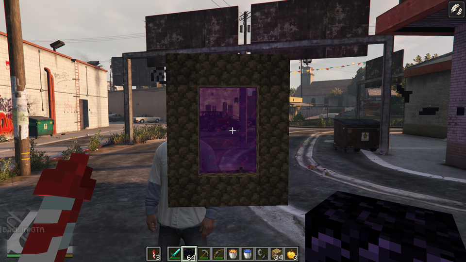

# GtaCraft

### GTA V Legacy ↔ Minecraft: Java Edition

**[Download the EN/HU preview and full source](https://github.com/gta5craft/GtaCraft/releases)** · **[Letöltés: EN/HU csomag és teljes forrás](https://github.com/gta5craft/GtaCraft/releases)**

[English](#english) · [Magyar](#magyar) · [Install / Telepítés](ONE_CLICK_SETUP.md) · [Known issues / Ismert hibák](KNOWN_ISSUES.md) · [Credits / Kreditek](THIRD_PARTY.md) · [Legal / Jogi nyilatkozat](LEGAL.md) · [Build](BUILD.md)

Build in Los Santos. Drive a GTA car across Minecraft terrain. Connect two running games through one experimental single-player bridge.

**Preview documentation: 9 October 2026. Gameplay binaries: 7 October 2026 wallfix, protocol 15.** Both original games are required. There are known bugs; clean-machine setup requires external dependencies and a separately built archive loader. The final wallfix has not been retested in retail gameplay.

**Dokumentáció: 2026. október 9. Modbinárisok: október 7-i wallfix, protokoll 15.** Mindkét eredeti játék szükséges. Ismert hibák vannak, új gépen külső függőségek és külön fordított archívumloader szükséges. A végső faljavítás játékbeli visszamérése elmaradt.

## English

The HU and EN archives use the same bilingual mod and **both start in English**; their documentation language differs. Switch live with **Insert → Status and keys → Menu language → English / Magyar**. The selection is saved as `sMenuLanguage=en` or `hu` in `GtaCraft.ini`. User-named favorites, saved places and executable commands are preserved. See [current release notes](CURRENT_RELEASE.md), [actual package contents](PACKAGE_CONTENTS.md), and [setup guide](ONE_CLICK_SETUP.md).

GtaCraft connects a running **GTA V Legacy** game to a running **Minecraft: Java Edition** game. Build and mine in Los Santos, or bring native Franklin, GTA vehicles and weapons into a Minecraft Overworld. Minecraft supplies the blocks, inventory and simulation; GTA supplies its native world, characters, vehicles and renderer.

**Unofficial project. Not approved by or associated with Rockstar Games, Take-Two Interactive, Mojang or Microsoft. NOT AN OFFICIAL MINECRAFT PRODUCT. NOT APPROVED BY OR ASSOCIATED WITH MOJANG OR MICROSOFT.** You need your own legitimately licensed copies of both games. The project license does not license either game's content. No publisher approval or public-release clearance is claimed; see [LEGAL.md](LEGAL.md).

### Changes included in the latest mod pair

- **Driving:** wall correction now places the vehicle before restoring the current projected wall-tangent velocity, with a fresh identity check. Corner contact and break admission remain constrained. This final fix has targeted regression/build evidence, but **no post-fix retail gameplay retest**.
- **Inventory:** cross-world equipment transfer now includes armor, offhand ItemStacks and elytra components. It cannot restore equipment already lost in an older version.
- **Vehicle visibility:** parked-car depth probing addresses the observed disappearance of cars after switching to Minecraft authority. General depth correctness is still experimental.
- **Combat:** native bullets can request vanilla block loot after successful removal, including when the backing Minecraft player is Creative. Hostile bodies have a conservative hit supplement and red outlined target indication; permissions, gamerules and material loot still matter.
- **Annihilator:** stock pilot machine guns bridge to Minecraft entities and blocks, using native aircraft fire and forward direction including pitch. The default aircraft-fire control is RMB/controller A; replacement models can use an approximate muzzle fallback. This does not add an Annihilator Stealth turret path.
- **Explosions:** supported rockets/grenades and observed native vehicle blasts request Minecraft power **5.8**, approximately three TNTs' nominal affected volume; it is one blast, subject to material resistance, loot and protection rules.
- **Vehicle effects:** Minecraft exhaust, qualifying drift/burnout smoke and cosmetic burning-car flames are available in eligible linked GTA/Overworld scenes, including while driving. The occupied car gets emission priority; particles face the current GTA camera. Cosmetic flames do not independently ignite blocks.
- **Movement:** the native Overworld car jump can be requested in reverse or airborne, with default 1.5-second cooldown. Horn is E/controller L3 by default; motorbikes, bicycles, boats, aircraft and trains are excluded. Normal cave falls remain possible; emergency backtracking requires **more than 512 blocks** below the last safe feet.
- **End encounter:** five rooftop crystal towers above Los Santos, with a temporary **16–32 chunk** view budget around the tower cluster, restored afterward. Distant crystal/entity delivery has separate limits and is not guaranteed.
- **Police:** lifecycle retention and surface selection have changes, but **stable ground pursuit has not been established as fixed or accepted**. The last natural-terrain observation saw an owned foot officer disappear after two seconds and no patrol car within 29 seconds. Helicopters do not prove ground-police correctness.

These are implemented behaviors and development changes, not a certification that every gameplay path works. Read [known issues](KNOWN_ISSUES.md) and [the current release notes](CURRENT_RELEASE.md).

### What is implemented

The table describes code present in this development line, rather than a promise that every combination is playable. Settings can disable individual features.

| Area | Behavior and boundaries |
|---|---|
| GTA mirror world | A separate Minecraft mirror save supplies blocks, inventory and Minecraft-controlled movement against sampled GTA collision. Blocks, entities, items, particles and the Minecraft interface appear inside GTA. GTA interiors, terrain and moving obstacles are subject to collision and depth limitations. |
| Natural Own Overworld | With `start=overworld` and `ownrender=gta`, the intended default is a natural Minecraft Overworld rendered in GTA with native Franklin. An acknowledged handoff is required before Minecraft's own world picture is hidden. `ownrender=mc` retains the Minecraft presentation. Native GTA rendering is limited to the supported local Overworld; other dimensions and remote worlds can use the Minecraft-only path. |
| Travel and saves | F9 and supported portals switch between the own save and GTA mirror save. Reopening a recognized existing local save after the mod's title menu now clears the stale menu state that blocked both return routes. Cobblestone gates can maintain coordinate-related pairs; inventories and supported horse travel are bridged. Worlds, gate links and waypoints are saved locally. F10 deliberately starts a fresh run by archiving both mod worlds under `gtacraft-deleted-worlds` and clearing shared-inventory/companion state. |
| Building and physics | Minecraft places and removes real blocks. Streamed collision shapes and locally mounted collider assets let native peds and cars contact nearby blocks. Vehicle impacts can damage permitted blocks. Partial shapes, streaming gaps, water, slopes and large terrain transitions are not universally validated. |
| Native cars | The menu creates ground and air vehicles, offers tuning and paint, and retains script ownership instead of immediately releasing a spawned vehicle. Menu seating and normal F/G entry have guarded native-control handoffs. The earlier logged death/ejection after successful seating remains a separate unresolved issue. Saved-car startup and long-term persistence remain open. |
| Car jump and ragdoll recovery | In the native Own Overworld, the configurable horn action (default **E**) requests one car jump per press, including while reversing or airborne, with a default 1.5-second cooldown. Horizontal velocity is retained. A living native Franklin in continuous ragdoll for seven seconds receives an automatic task-clear/upright attempt with the same heading and bounded retry. Recovery does not teleport him, prevent death or guarantee safe ground. |
| Ledge and shore assistance | A native jump near a facing full-cube Minecraft ledge can request GTA's own climb once. At the surface of custom Minecraft water, face a dry full-cube shore and press **Space**; release before the next attempt. The helper requires current collision/water data, a real native collider, a nearby ledge and clear standing room. Partial shapes, submerged contact and unknown landings are refused. GTA controls the actual climb; success on these cubes remains unverified. |
| HUD and radar | Minecraft world composition is ordered before the native GTA UI so the weapon wheel, phone and radio can remain visible above it. Los Santos radar is hidden in the Own Overworld and Minecraft GUI/fake menu, then its previous visibility is restored in the GTA mirror. Historical live captures show selected UI states; every camera, pause state and depth interaction is not certified. |
| Combat and block damage | Native bullets, supported melee tools and explosives are bridged to Minecraft targets and permitted blocks; damage and death also have cross-game handling. The explosive observer now follows player-owned projectiles and records bounded read-only firing/ammo observations. The reported spontaneous shot when aiming with RMB remains unresolved. Material resistance, protected blocks and vanilla drop rules matter. |
| Strong explosions | Observed nearby native car explosions and supported rockets/grenades request one Minecraft block blast of power **5.8** at the mapped location. This approximates three TNTs' nominal volume, not three simultaneously primed TNT entities. Molotov and harmless smoke are excluded. The native GTA explosion remains; host-origin block blasts suppress the echo back to GTA. The car observer is bounded to 160 m and 256 vehicles and can miss unobserved events. |
| Vehicle particles | Nearby running vehicles emit Minecraft exhaust particles; supported grounded drift/burnout states emit wheel smoke. Burning vehicles also emit cosmetic Minecraft flames, including engine-off wrecks. Particle quads face the current GTA camera during turns. The occupied car receives its batch before ambient traffic, even if world enumeration omits it. These effects supplement GTA's effects and do not ignite blocks or add explosions. |
| Trains and bedrock | The paired train controller requests a large radius-eight Minecraft clearing burst for coherent native train contacts, sparing bedrock while removing other loaded blocks, including materials normally protected from car impacts. Bedrock contact stops and disables the train with a damage-free explosion effect and no Minecraft terrain blast. Collider removal waits for confirmed Minecraft air. Native rail contact, uninterrupted passage and actual wreck appearance still need retail acceptance. [Train behavior and checks](docs/TRAIN_BEDROCK_2026-10-05.md). |
| TNT on GTA surfaces | In the GTA mirror, fresh native/cache hit evidence can admit normal Minecraft TNT placement on nearby GTA ground and walls. The ordinary server item-use path still checks reach, permissions and inventory. Placement remains aligned to the Minecraft grid. Primed TNT, all surfaces and survival/creative interactions need manual feedback on this build. |
| Animals and police | Exported passive animals hit by actual native bullets/explosions can request at least one wanted star. Native Own Overworld play supports up to four local foot police and, from two stars, one ground patrol car. They request nearby collider support, approach on bounded routes and wait or brake when evidence is missing. The car needs broad, flat, dry full-cube support; driver exit is guarded. This is not complete GTA navigation over all Minecraft terrain. |
| XP and dropped items | XP attraction uses bounded velocity and prompt tracking updates instead of direct position jumps; close pickup still uses vanilla rules. Dropped non-block items use Minecraft's complete ground model, retaining its supplied thickness, bob and spin. Block drops keep their existing presentation. Intentionally flat custom models remain flat; full resource-pack support is not certified. |
| Events and progression | Source includes night invasions, pedestrian/police reactions, GTA death drops and XP, traders, portal animals, horse travel, elytra and a custom End fight above Los Santos with islands, crystal towers, gateways and a dragon. These broader features are inherited/extended development features, not newly verified end-to-end for the latest pair. |
| Time, weather and appearance | Linked time, weather, sleep and cutscene handling; GTA-inspired block lighting, fog and exposure controls. Mob/entity night fill now follows texture and tint, preserving skin colour instead of adding a blue-gray coat. Native depth occlusion is still incomplete, especially across vehicles, peds, interiors and camera changes. |
| Developer menu | Insert opens vehicle, NPC/bodyguard, police, player, time/weather, teleport, item/entity, event, command and mod-setting pages. Search, favorites, recent selections and custom waypoints are supported. These controls can change the world or player state; use a backed-up test save. |
| Locate and teleport | GTA place categories, map destinations and coordinates; Minecraft structure/biome/point/block/entity searches and saved dimension-aware waypoints. Some searches examine only loaded chunks. An Own-world search may switch worlds; teleport/support checks are bounded and are not a guarantee against every bad landing. |
| Experimental multiplayer | The fork retains friend-join/e4mc-related code. This candidate is prepared for one local integrated-server pair. Public servers, remote native Own rendering and multiplayer synchronization are not accepted capabilities. |

### How the two games cooperate

`GtaCraft.asi` is a C++ ScriptHookV plugin. The modified SkyCraft Fabric JAR is the Java client/integrated-server side. They exchange state and bounded event queues through Windows shared memory named `Local\SkyCraft_v1`. The name retains its upstream origin; the current protocol is **15**, so matching ASI and JAR versions are essential.

Minecraft exports meshes, textures produced during the running game, collision shapes, player state and interface frames. GTA draws that geometry through Direct3D 11 and composites the Minecraft interface with its native UI. A separately installed archive loader and collider DLC provide native block contact. These dependencies are material: drawing a block alone does not establish a physical floor.

Input and player authority depend on the mode. Minecraft can drive the puppet and camera in the mirror; native Franklin can remain authoritative in the supported Own scene and while driving. Loading, menus, death, reconnects, generation changes and origin rebasing must be checked before accepting a handoff or event. GTA uses Z-up and Minecraft uses Y-up, with the axes converted at approximately one block per metre. Exported nearby sections and entities are bounded; this does not import all of San Andreas into a Minecraft save.

### Requirements

| Component | Development target |
|---|---|
| Operating system / graphics | Windows x64; GTA Direct3D 11. Both games must run at the same time. No general performance minimum or FPS guarantee has been established. |
| GTA | A licensed **GTA V Legacy 1.0.3889.0** installation and working Story Mode. GTA Enhanced, GTA Online, FiveM and other patches are outside this candidate's support. |
| ScriptHookV | Official **v3889.0 / 1158.13**, using the Legacy `dinput8.dll` ASI loader; obtain it from [Alexander Blade](https://www.dev-c.com/gtav/scripthookv/). |
| Minecraft | Licensed Java Edition **26.3**, Fabric Loader **0.19.5**, Fabric API **0.161.0+26.3**, Java **25 x64**, with `--enable-native-access=ALL-UNNAMED`. These are the pinned development inputs, not permission to mix arbitrary versions. |
| Launcher | A separately downloaded [Prism Launcher](https://prismlauncher.org/download/windows/) or a compatible configured Fabric instance. Sign in yourself through the normal Microsoft flow. |
| Native colliders | The matching generated collider pack, properly mounted in a local mods archive, and the supported local loader built from corresponding source. Loader binaries are omitted from this preview. An official upstream loader has not been proved equivalent to the patched local loader. The authored collider DLC is included; its mount is still a separate prerequisite. |
| Runtime | Install the official [Microsoft Visual C++ x64 runtime](https://learn.microsoft.com/en-us/cpp/windows/latest-supported-vc-redist?view=msvc-170) if required by your locally built loader/launcher. |

Read the candidate's `VERSION.json` and hash manifest for the exact released artifact pair. Do not substitute the original SkyCraft JAR or an older protocol-13 JAR. JAR metadata may retain the upstream `skycraft` identifier/name; this is an adapted fork, not the unchanged upstream binary.

### Local installation and first start

1. Back up your GTA mods/configuration and Minecraft saves. Close both games before replacing files. Use a separate Minecraft test instance and keep an untouched GTA installation available.
2. Install the supported games and external prerequisites above from their authors. For this Story Mode mod, use the platform's supported BattlEye setting/launch option; see [Rockstar's Story Mode FAQ](https://support.rockstargames.com/articles/1nenwhZlVrJY6CTFeSS2Fx/grand-theft-auto-online-battleye-faq). Keep this modded setup out of GTA Online.
3. Prepare the local collider archive and its supported source-built loader separately. See [AI_INSTALL.md](AI_INSTALL.md) for the missing-dependency boundary. Do not copy someone else's `update.rpf`, game assets or archive keys, and do not install two archive loaders together.
4. For a candidate that includes the setup UI, open **`Start.cmd` → Browse → Install → Play**. Browse to the actual Legacy game folder, launcher and dedicated Fabric instance. Review the resolved paths before Install. Play is appropriate only after dependencies and the collider/loader setup have passed that candidate's checks. This documentation does not certify an unfinished installer or a clean-machine run.
5. Manual alternative: place the candidate's `GtaCraft.asi` and a reviewed `GtaCraft.ini` beside `GTA5.exe`. Put the **matching** GtaCraft Fabric JAR and pinned Fabric API JAR in your instance's `.minecraft/mods/`; back up/remove the older SkyCraft/GtaCraft JAR from that instance to avoid loading two copies. Use the supplied clean config template, rather than a developer's absolute paths or account files.
6. In `.minecraft/config/skycraft.properties`, use `start=overworld`, `ownrender=gta`, and an empty `join=` for the intended local native-Franklin startup. Use `start=gta` for mirror-first startup or `ownrender=mc` for Minecraft presentation. Older template comments saying that GTA always freezes in Own mode are historical.
7. Launch the dedicated Fabric instance through Prism and launch GTA through its licensed platform into Story Mode if using the manual route. Wait for both worlds and the link to become ready. Do not reset worlds to repair a pending handshake. The latest startup/reload fixes have source/build evidence; their full clean-start acceptance remains open.

### Default controls

These are mode-sensitive defaults. GTA control remapping and configurable F9/F10/F11 keys can change them.

| Key/action | Purpose |
|---|---|
| Insert | Open/close the developer menu. Mouse or arrows/Enter navigate; Esc/Backspace return. |
| F7 | Toggle Minecraft player authority/mod mode; native Franklin becomes available when Minecraft does not own the player. This does not unload the plugin. |
| F8 | Request position/collision resynchronization. |
| F9 | Switch Own Overworld ↔ GTA mirror when a valid world transition is available. |
| F10 twice within five seconds | Fresh run: archive both worlds under `gtacraft-deleted-worlds`; delete shared-inventory and saved-companion state. This changes saves/state. |
| F11 | Mod's fake Minecraft title menu; Create New World opens the prepared own world. This is not an unrestricted replacement for Minecraft's normal world-selection flow. |
| G | Request nearest-car entry while Minecraft owns the player in the GTA mirror. |
| F / vehicle horn, default E | Normal native GTA entry/exit / car jump for an eligible driver in native Own Overworld, including reversing or airborne. Release then press again; the default cooldown is 1.5 seconds. E remains Minecraft inventory when input belongs to Minecraft. |
| Space at a shore | While surface-swimming in custom Minecraft water, face a nearby dry full-cube shore and press once to request a native climb. Release before retrying. Dry-jump ledge assistance follows the native jump automatically. |
| Ragdoll recovery (automatic) | After seven continuous seconds, eligible living native Franklin receives a recovery attempt. No extra key is needed; this is not death protection. |
| Esc / O | GTA pause / Minecraft menu in the routed GTA mirror context. Minecraft screens and Own mode use their context-specific input. |
| F5 | Minecraft camera cycling when Minecraft owns the camera. |
| Normal game bindings | Movement, mining/building, inventory and chat follow the active game's bindings. Native phone, weapon wheel and radio require native GTA authority. |

### Known limits and recovery

This is a manual demo, supplied as-is. Streaming/collision gaps can cause falls or invalid vehicle/ped contact. Native depth, long sessions, saved-vehicle startup, arbitrary mods, mission scripts, other game patches and complete terrain coverage remain open. A successful offline regression or historical frame is not a complete gameplay acceptance.

Three specific gameplay checks remain open: the reported spontaneous RMB firing/reload; the previously logged native death and ejection after successful seating; and GTA's acceptance/timing of native climbing on custom cubes, including shore Space input. Projectile ownership and entry-control fixes do not establish that the first two symptoms are solved. Ledge assistance requests the animation without teleporting or lifting the player. See [current release notes](CURRENT_RELEASE.md).

If the link is absent, check that the intended instance is loaded, only one matching mod JAR is present, and the ASI/JAR protocol pair matches `VERSION.json`. If native contact is missing, check the loader and collider mount before trying to drive. Keep `GtaCraft.log`, `ScriptHookV.log`, the local loader log and the instance's `logs/latest.log`; review/redact usernames, machine paths, chat and credentials before sharing them. Restore a matched ASI/JAR pair with both games closed. Leave world-reset buttons alone unless you explicitly want a fresh run.

### Development and credits

The GtaCraft-specific original code and adaptations were produced and modified through LLM-assisted development sessions, including Claude and Codex workflows, with human requests, review and manual feedback. This is a statement about the workflow, not a claim that upstream human-authored code was originally generated by AI or that AI output has guaranteed originality or correctness.

**chasmlol's [SkyCraft](https://github.com/chasmlol/SkyCraft)** is the MIT-licensed foundation for the Fabric side, shared-memory protocol and bridge/rendering approach. Its notices remain. **Alexander Blade** supplies ScriptHookV; **Tsuda Kageyu and Vyacheslav Patkov** supply MinHook/HDE; **martonp96 and Chiheb-Bacha** are credited for the archive-loader lineage. Fabric, Prism, Java and build-tool authors retain their own rights. The universal-modder project is credited for development methodology; see [THIRD_PARTY.md](THIRD_PARTY.md).

The root `LICENSE` applies MIT to original GtaCraft contributions within its stated scope. Separate upstream licenses, especially the GPL-3.0 loader, remain separate. Games, screenshots, artwork and trademarks are not relicensed by that file.

### Historical screenshots

These are unedited historical gameplay captures selected to illustrate the project. No user desktop, account login, personal chat or operating-system notification is included. Game content remains owned by its rights holders; the project license does not relicense these screenshots. Exact origins/hashes are in [the selection manifest](screenshots/selection-manifest.json).

Historical repository capture: a placed block and Minecraft interface in a GTA interior; not proof of every material or interior collision.

Historical menu overview. Labels describe the older build and can differ from current mode behavior.

Historical portal scene; not proof of every gate pairing, travel or reload path.

Historical phase-1 native Franklin/Overworld frame. Its visible radar predates the Own-mode radar-hide change.

Historical phase-1 HUD capture with native weapon wheel; no claim that the latest build's complete input/render behavior has been accepted.

Historical phase-1 Contacts capture. This is the fictional in-game phone, not a user's device or account.

Maintainer: **mannin1337 / gta5craft**. Contact and rights enquiries: [gekkovilaga@gmail.com](mailto:gekkovilaga@gmail.com). Technical bug reports may also use GitHub Issues.

---

## Magyar

A HU és EN ZIP ugyanazt a kétnyelvű modot tartalmazza, és **mindkettő angol menüvel indul**; a leírás nyelve különbözik. Élő váltás: **Insert → Status and keys / Állapot és billentyűk → Menu language / Menü nyelve → English / Magyar**. A választás `sMenuLanguage=en` vagy `hu` néven megmarad a `GtaCraft.ini` fájlban. Saját kedvencnevek, mentett helyek és parancsok megmaradnak. [Aktuális kiadás](CURRENT_RELEASE.md), [csomagtartalom](PACKAGE_CONTENTS.md), [telepítő és indító](ONE_CLICK_SETUP.md).

A GtaCraft egy futó **GTA V Legacy** és egy futó **Minecraft: Java Edition** között épít kapcsolatot. Építhetsz és bányászhatsz Los Santosban, vagy natív Franklint, GTA-járműveket és fegyvereket vihetsz a Minecraft saját Overworldjébe. A blokkokat, inventoryt és szimulációt a Minecraft, a natív világot, szereplőket, járműveket és megjelenítést a GTA adja.

**Nem hivatalos projekt. Nem kapcsolódik a Rockstar Games, Take-Two Interactive, Mojang vagy Microsoft vállalatokhoz, és azok nem hagyták jóvá. NEM HIVATALOS MINECRAFT-TERMÉK. A MOJANG ÉS A MICROSOFT NEM HAGYTA JÓVÁ, ÉS NEM ÁLL VELÜK KAPCSOLATBAN.** Mindkét játék saját, jogszerűen licencelt példánya szükséges. A projekt licence nem ad jogot a játékok tartalmához. A nyilvános terjesztés és bemutatás jogi feltételei rendezetlenek; lásd [LEGAL.md](LEGAL.md).

### A legfrissebb modpár változásai

- **Autózás:** a falkorrekció előbb helyezi át a járművet, utána állítja vissza az aktuális fal menti vetített sebességet, friss azonossági ellenőrzéssel. A sarokkontaktus és blokkbontás korlátozott marad. Ehhez célzott regresszió és teljes fordítás van, de **a végső javítást nem teszteltük újra a tényleges játékban**.
- **Inventory:** a világok közötti felszerelésátadás a páncélt, offhand ItemStackeket és elytra-komponenseket is kezeli. Korábban elveszett felszerelést nem állít vissza.
- **Autóláthatóság:** parkolóautó-depth mintavétel javítja a Minecraft-irányításra váltás után megfigyelt eltűnést. A teljes mélységkezelés továbbra is kísérleti.
- **Harc:** natív lövés után a sikeresen eltávolított blokk vanilla-lootot kérhet, a háttérben Creative Minecraft-játékos esetén is. Hostile mobokhoz óvatos testtalálati kiegészítés és piros körvonalas jelzés van. Jogosultság, gamerule és anyaghoz tartozó drop továbbra is számít.
- **Annihilator:** a hagyományos helikopter pilóta-gépfegyvere Minecraft-entityket/blokkokat is kezel, natív tüzeléssel és a helikopter térbeli irányával. Alapból jobb klikk/kontroller A; cserélt modellen közelítő csőtorkolat lehetséges. Ez nem új Annihilator Stealth-toronykezelés.
- **Robbanás:** támogatott rakéták/gránátok és megfigyelt autórobbanások **5,8-as** Minecraft-robbanást kérnek, nagyjából három TNT névleges érintett térfogatával. Ez egy robbanás; anyagellenállás, loot és védelem befolyásolja.
- **Autóeffektek:** Minecraftos kipufogófüst, megfelelő drift/burnout kerékfüst és kozmetikai égőautó-lángok az alkalmas GTA/Overworld-jelenetekben, vezetés közben is. A saját autó elsőbbséget kap, a részecskék az aktuális GTA-kamera felé fordulnak. A kozmetikai láng önmagában nem gyújt blokkot.
- **Mozgás:** a natív Overworld-autóugrás tolatva és levegőben is kérhető, alapból 1,5 másodperces várakozással. Kürt: E/kontroller L3; motor, bicikli, hajó, repülő és vonat nem jogosult rá. Normál barlangi zuhanás marad; vész-visszahelyezés csak az utolsó biztonságos talp alá **több mint 512 blokknyi** esésnél lehetséges.
- **End-harc:** öt felhőkarcolós kristálytorony Los Santos fölött. Átmeneti **16–32 chunkos** látótávolságkeret a toronycsoport körül, utána visszaállítás. A távoli kristályok/entityk külön korlátja megmarad; állandó megjelenésük nem garantált.
- **Rendőrök:** életciklus-megőrzés és felszínkeresés változott, de **a stabil földi üldözés nincs javítottnak/elfogadottnak igazolva**. Az utolsó természetes terepi megfigyelésben egy saját gyalogos rendőr két másodperc után eltűnt, 29 másodpercen belül nem érkezett járőrautó. A helikopterek jelenléte nem igazolja a földi rendőrséget.

Ezek implementált viselkedések és fejlesztési változások, nem minden játékhelyzet hibamentességi igazolásai. [Ismert hibák](KNOWN_ISSUES.md), [aktuális kiadás](CURRENT_RELEASE.md).

### A megvalósított funkciók

A táblázat a fejlesztési ágban szereplő kódot írja le. Nem ígéri, hogy minden kombináció végigjátszható. Egyes funkciókat a beállítások kikapcsolhatnak.

| Terület | Működés és határok |
|---|---|
| GTA-tükörvilág | Külön Minecraft-mentés adja a blokkokat, inventoryt és Minecraft-vezérelt mozgást a GTA-ból mintavételezett collision alapján. A blokkok, lények, tárgyak, részecskék és kezelőfelület a GTA képébe kerülnek. Belső terek, terep és mozgó akadályok esetén vannak collision- és mélységi korlátok. |
| Természetes saját Overworld | `start=overworld` és `ownrender=gta` mellett a kívánt alapindulás természetes Minecraft-világ, GTA-megjelenítéssel és natív Franklinnel. A Minecraft saját világképe csak visszaigazolt átvétel után rejtőzik el. `ownrender=mc` a Minecraft-megjelenítést tartja meg. A natív megjelenítés a támogatott helyi Overworldre korlátozott; más dimenzió és távoli világ Minecraft-only módba kerülhet. |
| Utazás és mentések | F9 és támogatott portálok váltanak a saját mentés és a GTA-tükör között. A mod főmenüje után egy felismert meglévő helyi mentés megnyitása már törli a mindkét visszautat tiltó beragadt menüállapotot. A cobblestone-kapuk koordinátákhoz rendelt párokat tarthatnak fenn; inventory és támogatott lóutazás kapcsolódik át. A világ, kapuk és saját helyek helyben mentődnek. F10 a két modvilágot a `gtacraft-deleted-worlds` alá archiválja, majd törli a közös inventoryt és a mentett társadatokat. |
| Építés és fizika | A Minecraft valódi blokkokat rak le és bont el. A továbbított collision-alakok és helyben betöltött collider assetek a közeli blokkokhoz natív ped-/autókontaktust adnak. Járműütközés is bonthat engedélyezett blokkokat. A részleges alakok, streamelési hézagok, víz, lejtők és nagy terepváltások általános elfogadása nyitott. |
| Natív járművek | A menü földi és légi járműveket, tuningot és festést kínál. A spawn megtartja a script tulajdonát, nem engedi el rögtön az autót. A menüs ülés és a normál F/G beszállás ellenőrzött natív vezérlésátadást kap. A sikeres ülés után korábban naplózott halál/kidobás külön, megoldatlan jelenség. A mentett autós indulás és tartós megmaradás nyitott. |
| Autóugrás és ragdollból felállás | Natív saját Overworldben a konfigurált kürt — alapból **E** — lenyomásonként egy autóugrást kér, tolatva és levegőben is, alapból 1,5 másodperces várakozással. A vízszintes sebesség megmarad. Élő natív Franklin hét másodpercnyi folyamatos ragdoll után automatikus feladattörlést és azonos irányú kiegyenesítési próbát kap, korlátozott újrapróbával. Nem teleportál, nem véd a haláltól és nem garantál biztonságos talajt. |
| Perem- és partelkapás | Natív ugrás közben egy közeli, előre eső teljes Minecraft-kockánál egyszer kérhető a GTA saját kapaszkodása. A saját Minecraft-víz felszínén nézz a száraz teljes kockás part felé, és nyomd meg a **Space**-t; új próbához engedd el. Friss ütközés-/vízadat, valódi natív collider, közeli perem és szabad állóhely szükséges. Részleges alak, merülés vagy ismeretlen cél nem indít segítséget. A tényleges felhúzást a GTA végzi; e kockák mászhatósága még nincs játékban igazolva. |
| HUD és radar | A Minecraft-világ a natív GTA-kezelőfelület elé kerül a rajzolási sorrendben, így a fegyverkerék, telefon és rádió fölötte maradhat. A Los Santos radar Own Overworldben és Minecraft GUI/fake menü alatt rejtett, GTA-tükörben a korábbi láthatóság áll vissza. Régi élő képek egyes állapotokat igazolnak; minden kamera, pause és mélységi helyzet nincs elfogadva. |
| Harc és blokkbontás | Natív lövedékek, támogatott közelharci eszközök és robbanások jutnak Minecraft-célpontokhoz és engedélyezett blokkokhoz; a sebzés/halál is kapcsolódik a két játék között. A robbanó lövedék figyelője már a játékos lövedékeit követi, és korlátozott, csak olvasó lövés-/lőszeradatot naplóz. A célzáskor jelentett önálló jobbklikkes lövés továbbra is megoldatlan. Anyagellenállás, védett blokkok és vanilla dropok számítanak. |
| Erős robbanások | Megfigyelt közeli natív autórobbanás és támogatott rakéta/gránát egy **5,8 erejű**, blokkokat romboló Minecraft-robbanást kér a megfelelő helyen. Ez három TNT névleges térfogatának közelítése, nem három egyszerre primed TNT. Molotov és ártalmatlan füst kimarad. Az eredeti GTA-robbanás megmarad; a hostból érkező blokkbontás nem visszhangzik vissza GTA-robbanásként. Az autófigyelő határa 160 méter és 256 jármű; nem megfigyelt eseményt kihagyhat. |
| Járműrészecskék | Közeli járó jármű Minecraft-kipufogórészecskét, támogatott földi drift/burnout kerékfüstöt ad. Égő jármű és álló motorú roncs kozmetikai Minecraft-lángot is kap. A részecskék forduláskor is az aktuális GTA-kamerára néznek. A saját, éppen használt autó füstje a forgalom előtt kap helyet, akkor is, ha kimarad a világjármű-listából. A GTA effektjei megmaradnak; e részecskék nem gyújtanak blokkot és nem adnak új robbanást. |
| Vonatok és bedrock | Igazolt vonatkontaktus nagy, nyolcblokkos sugarú Minecraft-bontást kér: a bedrock megmarad, más betöltött blokk — az autók elől védett anyag is — eltűnhet. Bedrocknál a vonat megáll, működésképtelenné válik és sebzésmentes robbanáseffektet kap, Minecraft-terepbontás nélkül. A collider csak visszaigazolt levegőnél szabadul fel. A natív sínkontaktus, megszakítás nélküli áthaladás és a roncs tényleges megjelenése játékbeli próbára vár. [Vonatkezelés és ellenőrzések](docs/TRAIN_BEDROCK_2026-10-05.md). |
| TNT GTA-felületen | A GTA-tükörben friss natív/cache találat engedheti a normál TNT-lerakást közeli GTA-talajra vagy falra. A vanilla szerverút továbbra is ellenőrzi az elérést, jogosultságot és készletet. A TNT a Minecraft-rácshoz igazodik. Primed TNT, minden felület és survival/kreatív működés kézi visszajelzésre vár ebben a buildben. |
| Állatok és rendőrök | Valódi natív lövedék-/robbanástalálat az exportált békés állaton legalább egy körözési csillagot kérhet. Natív Own módban legfeljebb négy helyi gyalogos rendőr és két csillagtól egy földi járőrautó működhet. Kérik a közeli collidertámaszt, korlátozott útvonalon közelednek; hiányzó bizonyítéknál várnak vagy fékeznek. Az autó széles, sík, száraz, teljes kockás talajt igényel, a sofőr kiszállása ellenőrzött. Nem teljes GTA-navigáció minden Minecraft-terepen. |
| XP és eldobott tárgyak | Az XP-vonzás közvetlen pozícióugrás helyett korlátozott sebességet és gyors követési frissítést ad; közel a vanilla felvétel marad. A nem blokk típusú eldobott tárgy a Minecraft teljes földi modelljét kapja, annak vastagságával, lebegésével és forgásával. A blokk típusú tárgyak korábbi megjelenítése megmarad. Szándékosan lapos egyedi modell továbbra is lapos; minden resource pack nincs igazolva. |
| Események és fejlődés | A forrás tartalmaz éjszakai inváziót, gyalogos-/rendőrreakciókat, GTA-halál utáni drop/XP-t, kereskedőt, portálállatokat, lóutazást, elytrát és Los Santos fölötti egyedi End-harcot szigetekkel, kristálytornyokkal, kapukkal és sárkánnyal. Ezek örökölt/bővített fejlesztési funkciók; az új párossal nincs mindegyik végig ellenőrizve. |
| Idő, időjárás és látvány | Összekapcsolt idő, időjárás, alvás és cutscene-kezelés; GTA-hoz igazított blokkvillágítás, köd és expozíció. A mob-/lényfelületek éjszakai derítése már a textúrát és színezést követi, kékesszürke bevonat helyett megőrzi a bőr színét. A natív mélységi takarás továbbra is hiányos, különösen járművek, pedek, belső terek és kameraváltások esetén. |
| Fejlesztői menü | Insert: jármű, NPC/testőr, rendőrség, játékos, idő/időjárás, teleport, tárgy/lény, esemény, parancs és modbeállítás. Keresés, kedvencek, előzmények és saját helyek is vannak. Ezek világot/játékosállapotot módosíthatnak; mentett tesztvilágon használd őket. |
| Keresés és teleport | GTA-helykategóriák, térképcél és koordináta; Minecraft-építmény/biom/pont/blokk/lény és dimenziót is mentő waypoint. Egyes keresések csak betöltött chunkokat néznek. Sajátvilág-keresés világváltást kérhet; a teleport támaszellenőrzése korlátozott, nem garantál minden esetben jó érkezést. |
| Kísérleti multiplayer | A fork megtartotta a baráthoz csatlakozás/e4mc körüli kódot. Ez a változat egy helyi, integrated-server pároshoz készült. Nyilvános szerver, távoli natív Own-megjelenítés és multiplayer-szinkron nem elfogadott képesség. |

### Hogyan működik

A `GtaCraft.asi` C++ ScriptHookV-plugin, a módosított SkyCraft Fabric JAR a Java kliens/integrated-server oldal. Windows shared memoryn, `Local\SkyCraft_v1` néven cserélnek állapotot és korlátozott eseménysorokat. A név az upstreamből maradt; a jelenlegi protokoll **15**, ezért pontosan összetartozó ASI/JAR szükséges.

A Minecraft mesh-eket, a futó játékban előállított textúrákat, collision-alakokat, játékosállapotot és kezelőfelületi képeket exportál. A GTA Direct3D 11-ben rajzolja a geometriát, és a Minecraft-kezelőfelületet a natív UI-val kompozitálja. A natív blokk-kontaktus külön archívumloadert és collider DLC-t igényel. Egy kirajzolt blokk önmagában nem bizonyított fizikai talaj.

A vezérlés és a játékos fölötti döntés módonként változik. A tükörvilágban Minecraft mozgathatja a bábut/kamerát; a támogatott Own helyzetben és vezetéskor natív Franklin maradhat mérvadó. Betöltés, menü, halál, újracsatlakozás, generációváltás és origóáthelyezés előtt ellenőrzött átvétel/esemény szükséges. GTA Z-up és Minecraft Y-up között tengelykonverzió van, körülbelül egy méter/blokk léptékkel. Közeli szakaszok és lények továbbítódnak korlátosan; nem kerül az egész San Andreas egy Minecraft-mentésbe.

### Követelmények

| Összetevő | Fejlesztési célverzió |
|---|---|
| Rendszer / grafika | Windows x64, GTA Direct3D 11. Mindkét játék egyszerre fut. Általános teljesítményminimum vagy garantált FPS nincs megállapítva. |
| GTA | Saját licencű **GTA V Legacy 1.0.3889.0**, működő Story Mode. Enhanced, GTA Online, FiveM és más patch nincs támogatva ebben a változatban. |
| ScriptHookV | Hivatalos **v3889.0 / 1158.13**, Legacy `dinput8.dll` ASI-loaderrel; [Alexander Blade oldaláról](https://www.dev-c.com/gtav/scripthookv/). |
| Minecraft | Saját licencű Java Edition **26.3**, Fabric Loader **0.19.5**, Fabric API **0.161.0+26.3**, Java **25 x64**, `--enable-native-access=ALL-UNNAMED` argumentummal. Ezek rögzített bemenetek; tetszőleges verziókeverés nincs igazolva. |
| Launcher | Külön letöltött [Prism Launcher](https://prismlauncher.org/download/windows/) vagy megfelelő Fabric instance. A Microsoft-bejelentkezést te végezd el a normál felületen. |
| Natív collider | Összetartozó generált collider pack, helyi mods archívumba bekötve, és a támogatott helyi loader teljes forrásból megépítve. Loader-bináris nincs ebben a kiadásban. A hivatalos upstream loader nincs a javított helyi loader egyenértékű helyettesítőjeként igazolva. |
| Runtime | A helyben épített loader/launcher igénye szerint hivatalos [Microsoft Visual C++ x64 runtime](https://learn.microsoft.com/en-us/cpp/windows/latest-supported-vc-redist?view=msvc-170). |

A csomag pontos párosát a `VERSION.json` és a hashjegyzék adja. Ne helyettesítsd eredeti SkyCrafttal vagy régi protokoll-13 JAR-ral. A JAR metaadataiban megmaradhat az upstream `skycraft` név/azonosító: ez adaptált fork, nem változatlan upstream bináris.

### Helyi telepítés és első indulás

1. Mentsd a GTA modokat/beállításokat és Minecraft-világokat. Másolás előtt mindkét játék legyen bezárva. Külön Minecraft-tesztinstance-t használj, és legyen elérhető érintetlen GTA-telepítés.
2. Telepítsd a fenti játékokat és külső függőségeket a szerzőik oldaláról. A Story Mode modhoz a platform támogatott BattlEye-beállítását/indítóargumentumát használd; [Rockstar tájékoztató](https://support.rockstargames.com/articles/1nenwhZlVrJY6CTFeSS2Fx/grand-theft-auto-online-battleye-faq). A modolt összeállítást tartsd távol GTA Online-tól.
3. Külön készítsd elő a helyi collider archívumot és támogatott, forrásból épített loaderét. A hiányzó függőség határát az [AI_INSTALL.md](AI_INSTALL.md) írja le. Más `update.rpf` fájlját, játékassetet vagy archívumkulcsot ne másolj. Ne telepíts két archívumloadert egyszerre.
4. Ha a helyi változat tartalmaz setupfelületet: **`Start.cmd` → Browse/Tallózás → Install/Telepítés → Play/Játék**. Add meg a valódi Legacy játékmappát, launchert és külön Fabric instance-t; telepítés előtt nézd át a feloldott útvonalakat. Play csak az adott változat függőség- és collider/loader-ellenőrzése után indokolt. Ez a leírás nem igazol befejezetlen installert vagy tiszta gépes működést.
5. Kézi út: a csomag `GtaCraft.asi` és átnézett `GtaCraft.ini` fájlja a `GTA5.exe` mellé kerül. A **hozzátartozó** GtaCraft Fabric JAR és rögzített Fabric API az instance `.minecraft/mods/` mappájába. A régi SkyCraft/GtaCraft JAR-t előbb mentsd el és vedd ki ebből az instance-ból, hogy ne legyen két példány. Tiszta configsablont használj, ne fejlesztői abszolút útvonalakat/fiókfájlokat.
6. `.minecraft/config/skycraft.properties`: a helyi natív Franklin-induláshoz `start=overworld`, `ownrender=gta`, üres `join=`. Tükörvilággal kezdéshez `start=gta`, Minecraft-megjelenítéshez `ownrender=mc`. A régi sablonkomment, amely szerint Own módban a GTA mindig áll, történeti.
7. Kézi úton indítsd a külön Fabric instance-t Prismen át, a GTA-t pedig a licencelt platformjáról Story Mode-ba. Várd meg a két világ és a kapcsolat kész állapotát. Függő kézfogást ne világresettel javíts. Az új indulás/újratöltés javításának van forrás/build bizonyítéka; teljes tiszta indulási elfogadása még nyitott.

### Alapvezérlés

A billentyűk az aktuális módtól függenek. GTA-átkötés és konfigurált F9/F10/F11 módosíthatja őket.

| Billentyű/művelet | Cél |
|---|---|
| Insert | Fejlesztői menü nyit/zár. Egér vagy nyíl/Enter; Esc/Backspace vissza. |
| F7 | Minecraft-játékosvezérlés/modmód kapcsolása; ha nem Minecrafté a játékos, natív Franklin vezérelhető. A plugin továbbra is betöltve marad. |
| F8 | Pozíció-/collision-újraszinkron kérése. |
| F9 | Saját Overworld ↔ GTA-tükör, érvényes világváltási helyzetben. |
| F10 kétszer öt másodpercen belül | Friss futam: a két világ archiválása a `gtacraft-deleted-worlds` alá; a közös inventory és a mentett társadatok törlése. Ez mentést és állapotot módosít. |
| F11 | A mod fake Minecraft-főmenüje; Create New World a kész saját világot nyitja. Nem teljesen szabad vanilla világválasztó helyettesítő. |
| G | Legközelebbi autóba beszállás kérése Minecraft-vezérlésnél, GTA-tükörben. |
| F / kürt, alapból E | Natív GTA be-/kiszállás / autóugrás jogosult sofőrként natív Own Overworldben, tolatva és levegőben is. Új ugráshoz engedd el és nyomd meg újra; az alapvárakozás 1,5 másodperc. Minecraft-input esetén az E továbbra is inventory. |
| Space a partnál | Saját Minecraft-vízben, a felszínen úszva nézz közeli száraz, teljes kockás part felé, és egyszer nyomd meg a natív kapaszkodás kéréséhez. Új próbához engedd el. Szárazon a peremsegéd a natív ugrást automatikusan követi. |
| Ragdollból felállás (automatikus) | Hét másodpercnyi folyamatos ragdoll után az élő, jogosult natív Franklin helyreállítási próbát kap. Külön billentyű nem kell; ez nem halálvédelem. |
| Esc / O | GTA pause / Minecraft-menü a GTA-tükör megfelelő inputhelyzetében. Minecraft-képernyő és Own mód saját útvonalat használ. |
| F5 | Minecraft kameranézet váltása, ha Minecrafté a kamera. |
| Normál játékkötések | Mozgás, bontás/építés, inventory és chat az aktuális játék kötése szerint. Natív telefon/fegyverkerék/rádió natív GTA-játékosvezérlést igényel. |

### Ismert korlátok és helyreállítás

Kézi demó, garancia nélkül. Streamelési/collision-hézag zuhanást vagy rossz ped-/autókontaktust okozhat. Natív mélység, hosszú munkamenet, mentett autós indulás, tetszőleges más mod, küldetések, új patch és teljes tereplefedés még nyitott. Offline regresszió vagy régi kép nem teljes játékelfogadás.

Három konkrét játékbeli kérdés nyitott: az önálló jobbklikkes lövés/újratöltés; a sikeres ülés után korábban naplózott natív halál és kidobás; valamint a GTA kapaszkodási elfogadása/időzítése a saját kockákon, a parti Space mintavételével együtt. A lövedéktulajdon és a beszállási vezérlés javítása nem bizonyítja az első két tünet megoldását. A peremsegéd animációt kér, nem teleportálja vagy emeli a játékost. [Aktuális kiadás](CURRENT_RELEASE.md).

Hiányzó kapcsolatnál nézd meg a jó instance-t, az egyetlen megfelelő mod JAR-t és a `VERSION.json` szerinti protokollpárt. Natív kontaktus hiányánál vezetés előtt a loadert/collider mountot ellenőrizd. Hasznos naplók: `GtaCraft.log`, `ScriptHookV.log`, helyi loadernapló és az instance `logs/latest.log` fájlja; megosztás előtt személyes nevet, gépi útvonalat, chatet és hitelesítési adatot takarj ki. Visszaállítani összetartozó ASI/JAR-t, bezárt játékokkal kell. Világresetet csak kívánt új futamhoz használj.

### Fejlesztés és kreditek

A GtaCraft-specifikus eredeti kód és adaptációk LLM-segített fejlesztési munkamenetekben készültek és módosultak, Claude- és Codex-munkafolyamatokkal, emberi kérésekkel, átnézéssel és kézi visszajelzéssel. Ez a munkafolyamat leírása; nem állítja, hogy az upstream emberi szerzők munkáját eredetileg AI írta, vagy az AI-kimenet eredetisége/hibamentessége garantált.

**chasmlol [SkyCraft](https://github.com/chasmlol/SkyCraft)** projektje az MIT-licencű Fabric-oldal, shared-memory protokoll és bridge/renderelési megközelítés alapja. Az eredeti jogi megjegyzések megmaradnak. **Alexander Blade**: ScriptHookV; **Tsuda Kageyu és Vyacheslav Patkov**: MinHook/HDE; **martonp96 és Chiheb-Bacha**: archívumloader-előzmények. Fabric, Prism, Java és buildeszközök szerzői megtartják saját jogaikat. A universal-modder fejlesztési módszertani kredit; részletesen [THIRD_PARTY.md](THIRD_PARTY.md).

A gyökér `LICENSE` a saját GtaCraft-hozzájárulásokat a megadott hatókörben MIT alatt adja. Az upstream licencek, különösen a GPL-3.0 loader, külön érvényesek. Játék, kép, artwork és védjegy nem kerül ezzel MIT alá.

### Történeti képek

Változatlan történeti gameplay-felvételek a projekt bemutatásához. Felhasználói asztal, fiókbelépés, személyes chat és operációsrendszer-értesítés nincs bennük. A játékok tartalmának jogai a jogosultaknál maradnak; a projekt licence a képekre nem ad játék-IP jogot. Eredet és hash: [képjegyzék](screenshots/selection-manifest.json).

Történeti repository-kép: blokk és Minecraft-kezelőfelület GTA-belső térben. Nem minden anyag/belső tér collision-bizonyítéka.

Régi menüáttekintés. A feliratok a korábbi buildhez tartoznak, a mostani módoktól eltérhetnek.

Történeti portálkép; nem minden kapupár, utazás és újratöltés bizonyítéka.

Történeti phase-1 natív Franklin/Overworld-kép. A látható radar megelőzi az Own módban elrejtő módosítást.

Történeti phase-1 HUD-felvétel. Nem az új build teljes input-/renderelési elfogadása.

Történeti phase-1 Contacts-kép. Fiktív játéktelefon, nem a felhasználó eszköze vagy fiókja.

Projektgazda: **mannin1337 / gta5craft**. Kapcsolat és jogi megkeresés: [gekkovilaga@gmail.com](mailto:gekkovilaga@gmail.com). Technikai hibákhoz GitHub Issues is használható.
