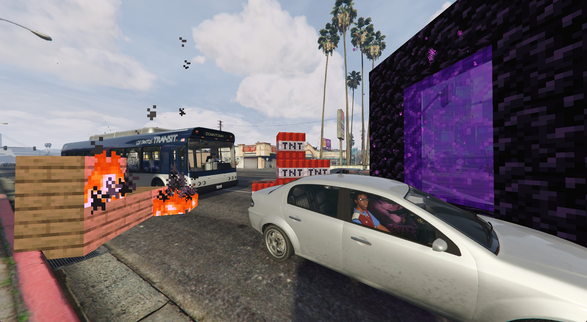
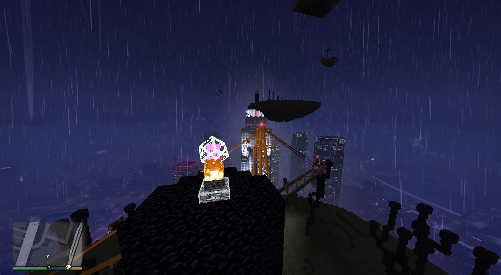
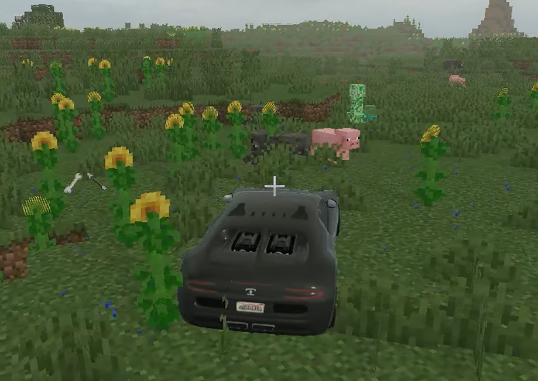
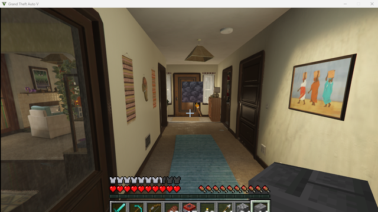
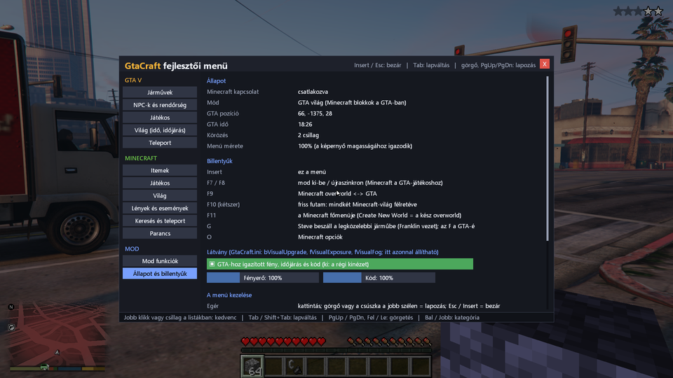
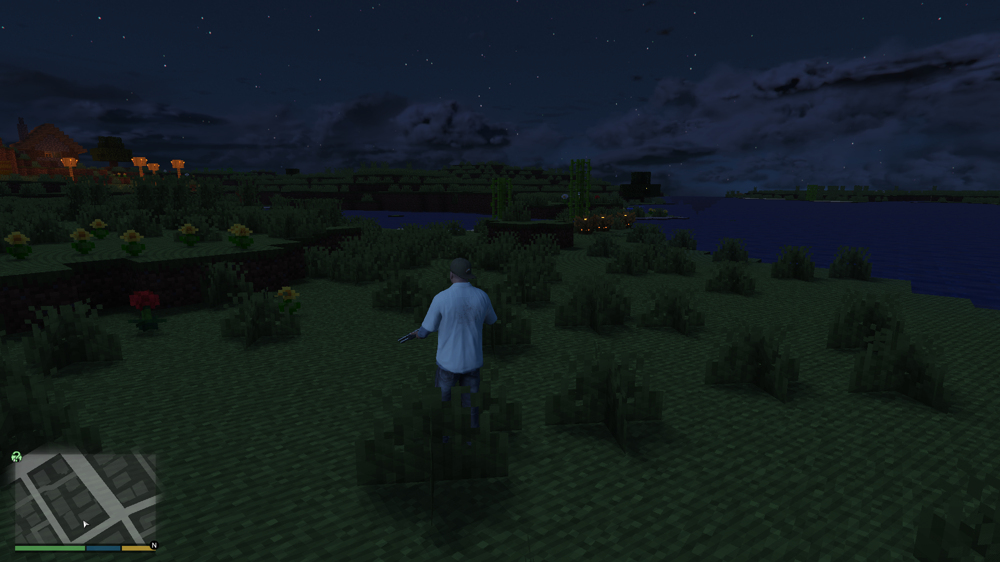
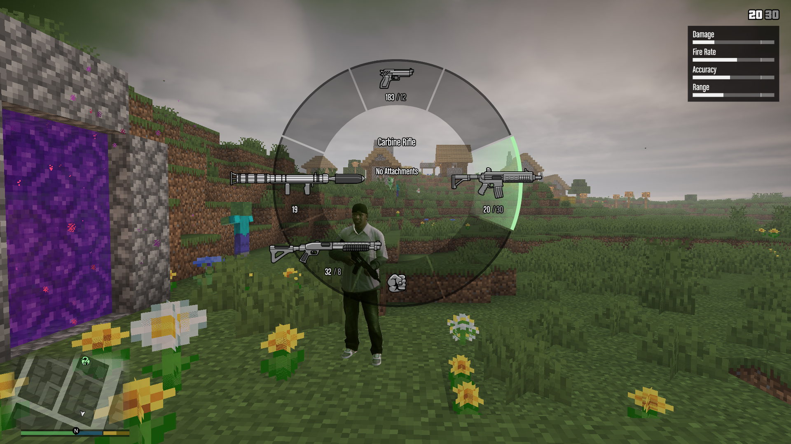
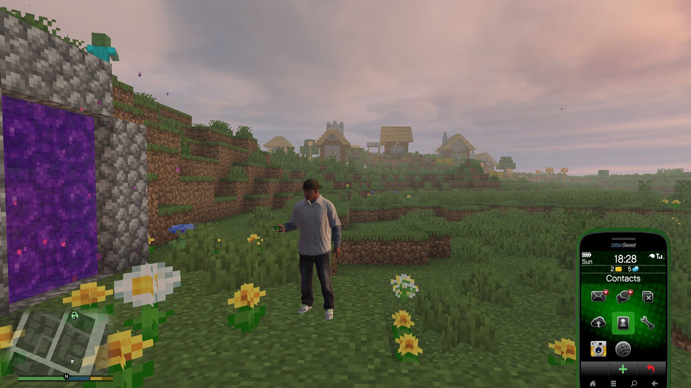

# GtaCraft

### Build in Los Santos. Drive through Minecraft.

[Download / Letöltés](https://github.com/gta5craft/GtaCraft/releases) · [English](#english) · [Magyar](#magyar) · [Setup](ONE_CLICK_SETUP.md)

*The End fight over the city of Los Santos*

## English

**GtaCraft brings GTA V and Minecraft: Java Edition together in one experimental single-player mod.** Build and mine in Los Santos, or take Franklin, GTA vehicles and weapons into a natural Minecraft Overworld. Both games run at the same time: Minecraft supplies its world and simulation, while GTA brings its characters, vehicles and action.

You need your own original copies of both games. **NOT AN OFFICIAL MINECRAFT PRODUCT. NOT APPROVED BY OR ASSOCIATED WITH MOJANG OR MICROSOFT.** This project is also independent of Rockstar Games and Take-Two Interactive.

### What you can do

| Feature | In the mod |
|---|---|
| Two connected worlds | Play in a natural Minecraft Overworld or a separate Minecraft mirror of the GTA world. Switch with F9 or supported portals. |
| Franklin in Minecraft | Explore on foot with native GTA movement, weapons and vehicles. Minecraft presentation/control is also available. |
| Driving and drifting | Drive across nearby Minecraft terrain with streamed block collision. Strong vehicle impacts can break permitted blocks. |
| Car jump | Use the horn, **E / controller L3** by default, to jump an eligible car in the native Overworld—even in reverse or airborne. Default cooldown: 1.5 seconds. |
| Building and mining | Place and remove Minecraft blocks in Los Santos and the Overworld. Successful native bullet block removal can produce normal Minecraft loot. |
| Guns and melee | Use supported GTA weapons against Minecraft entities and blocks. Hostile targets have a red target outline and additional body-hit handling. |
| Explosions | Supported rockets, grenades and observed car explosions damage Minecraft terrain. Their block blast is roughly equivalent to three TNTs by nominal affected volume, with normal material/protection rules. |
| Helicopter weapons | The stock **Annihilator** pilot machine guns interact with Minecraft mobs and blocks. |
| TNT in Los Santos | Place TNT on supported nearby GTA ground/walls, using the normal Minecraft grid, reach and inventory rules. |
| Smoke and fire | Minecraft exhaust, qualifying drift/burnout smoke and cosmetic burning-car flames supplement GTA effects in linked GTA/Overworld scenes, including while driving. Particles face the camera. |
| GTA HUD above Minecraft | Native phone, weapon wheel and radio can appear above the Minecraft world. The Los Santos minimap is hidden in the Minecraft Overworld and Minecraft menus. |
| Items and XP | Dropped non-block items use their complete Minecraft ground models. XP orbs use attraction movement toward the player. |
| Inventory and equipment | World transfer handles inventory, armor and offhand equipment, including elytra components. |
| Movement assistance | Native ledge/shore climb assistance and a recovery attempt after seven continuous seconds of ragdoll. Normal cave falls remain possible. |
| Animals and wanted levels | Hitting exported passive animals can trigger a wanted level. The Overworld has experimental local foot/patrol-police support as well as native aerial responses. |
| Trains and bedrock | Coherent train contact can clear nearby non-bedrock Minecraft blocks. Bedrock requests a stopped/disabled train with an explosion effect while preserving the blocks. |
| End encounter | A custom End fight above Los Santos, with up to five rooftop crystal towers and an increased Minecraft view budget around the cluster. |
| Events and survival features | Night invasions, traders, death drops/XP, horses, elytra, linked time/weather and sleep. |
| Developer menu | Spawn vehicles/NPCs, customize cars, change player/weather settings, get items, trigger events, run supported commands and teleport. Search, favorites, recent selections and saved waypoints are included. |
| English and Hungarian | The menu starts in English. Change it live at **Insert → Status and keys → Menu language → English / Magyar**. Your choice is saved. Both ZIPs contain the same mod and full bilingual documentation. |

These features describe the implementation. This is an **experimental preview**: terrain collision, depth, long sessions and Overworld ground-police behavior still have limitations. Read [Known issues](KNOWN_ISSUES.md), use a separate test instance and back up your saves. Broader progression features are not certified as a complete playthrough.

### Requirements

| Component | Supported setup |
|---|---|
| System | Windows x64, DirectX 11; both games running together |
| GTA | Licensed **GTA V Legacy 1.0.3889.0**, Story Mode |
| Minecraft | Licensed Java Edition **26.3**, Fabric Loader **0.19.5**, Fabric API **0.161.0+26.3** |
| Java | **Java 25 x64**, with `--enable-native-access=ALL-UNNAMED` |
| Launchers | Your normal GTA launcher and a configured [Prism Launcher](https://prismlauncher.org/download/windows/) instance |
| Native dependencies | Matching [ScriptHookV](https://www.dev-c.com/gtav/scripthookv/) and Legacy ASI loader, plus the separately built custom archive loader and collider mount |

GTA Enhanced, GTA Online, FiveM, arbitrary patches and multiplayer synchronization are outside this preview's supported setup. Keep the bundled ASI/JAR pair together; do not mix it with another SkyCraft or older GtaCraft JAR.

### Installation and launch

1. Download the **EN or HU preview ZIP** from [Releases](https://github.com/gta5craft/GtaCraft/releases) and extract it. Both include the paired mod files, authored collider DLC, source, licenses and setup scripts.
2. Back up your GTA mods and Minecraft saves. Use a dedicated Minecraft instance and close both games before installing.
3. Configure the original games and the matching ScriptHookV/Fabric/Java dependencies. Sign in through your normal launchers.
4. Build the **custom archive loader** from the supplied source and prepare the **collider mount**. The loader binary and proprietary SDKs are not distributed. The [setup guide](ONE_CLICK_SETUP.md) and [loader instructions](LOADER_MODIFICATIONS.md) explain this prerequisite.
5. Open **Start.cmd**, browse to the GTA folder, official GTA launcher, Prism executable and imported instance. Use **Check setup → Install → Play**. Once prerequisites and paths are prepared, the buttons update the mod pair and launch both games.
6. Enter GTA Story Mode and let the Minecraft world/link load. The supplied configuration starts in the natural Overworld with native GTA rendering.

First-time setup requires the separate dependencies above; it is not a certified clean-machine one-click install. The installer backs up replaced mod files and preserves saves/settings. Manual installation and recovery are in [ONE_CLICK_SETUP.md](ONE_CLICK_SETUP.md); an assistant-friendly guide is in [AI_INSTALL.md](AI_INSTALL.md).

### Controls

| Key/action | Purpose |
|---|---|
| **Insert** | Open/close the developer menu |
| **F7** | Toggle Minecraft/native player authority |
| **F8** | Request position/collision resync |
| **F9** | Switch Overworld ↔ GTA mirror |
| **F11** | Open the mod's Minecraft-style title menu |
| **G** | Nearest-car entry request when Minecraft controls the player in the GTA mirror |
| **F** | Normal native GTA vehicle entry/exit |
| **E / horn** | Car jump in eligible native Overworld driving; Minecraft inventory when Minecraft owns input |
| **Space near a shore** | Request native climb from supported Minecraft surface water onto a nearby dry full-cube ledge |
| **Esc / O** | GTA pause / Minecraft menu in the routed GTA mirror context |
| **F5** | Minecraft camera cycle when Minecraft owns the camera |
| **F10 twice within 5 seconds** | Fresh run: archive both mod worlds and **delete shared-inventory/saved-companion state** |

Bindings depend on the active mode and GTA remapping. Car jump excludes motorcycles, bicycles, boats, aircraft and trains. Phone, radio and weapon wheel use normal GTA controls when native GTA authority is active.

### How it works and where to get the source

The C++ **GtaCraft.asi** plugin and modified SkyCraft Fabric mod exchange world/player state through local Windows shared memory. Minecraft exports nearby geometry, textures, collision and gameplay events; GTA draws them through Direct3D 11. A separate local archive loader and authored collider DLC provide native block contact.

Nearby terrain is streamed and the coordinate origin can be moved as you travel. Coverage is bounded: this is not a promise of unlimited seamless terrain or importing all of San Andreas into a Minecraft save.

Download the named **source ZIP** from [Releases](https://github.com/gta5craft/GtaCraft/releases) for the complete implementation. Both gameplay ZIPs also contain `source/`. This web repository presents the documentation and images; GitHub's automatic “Source code” download contains that documentation tree. See [SOURCE.md](SOURCE.md) and [BUILD.md](BUILD.md).

### Development, credits and legal information

The GtaCraft-specific original code and adaptations were created through **LLM-assisted development using Claude and Codex**, guided by human requests and gameplay feedback. Upstream projects remain credited to their original human authors; AI involvement is not a guarantee of correctness or originality.

[chasmlol's SkyCraft](https://github.com/chasmlol/SkyCraft) provides the Fabric/shared-memory/rendering foundation. Credits also include Alexander Blade (ScriptHookV), Tsuda Kageyu and Vyacheslav Patkov (MinHook/HDE), martonp96 and Chiheb-Bacha (archive-loader lineage), Fabric, Prism and the [universal-modder](https://github.com/rehan-remade/universal-modder) development methodology. Full attributions and licenses: [THIRD_PARTY.md](THIRD_PARTY.md).

Original GtaCraft contributions retain their existing MIT license; separate components keep their own licenses, including the GPL-3.0 loader source. The license does not cover the games, their assets or trademarks. No original games, account data, activation keys, proprietary SDKs or custom loader binary are included.

This is an unofficial, free project. Publisher approval is not claimed, and a disclaimer does not grant permission to use either game's IP. Read [LEGAL.md](LEGAL.md) for the policy references and distribution boundaries. Contact and rights enquiries: **[admin@mannin.hu](mailto:admin@mannin.hu)**. Report technical problems through [Issues](https://github.com/gta5craft/GtaCraft/issues).

### More screenshots / További képek

These gameplay images illustrate the project; they are not acceptance tests for every current feature. Game imagery remains owned by its original rights holders. [Image manifest](screenshots/selection-manifest.json).

*Driving in Minecraft*

## Magyar

**A GtaCraft egy kísérleti, egyjátékos mod, amely összeköti a GTA V-öt és a Minecraft: Java Editiont.** Építhetsz és bányászhatsz Los Santosban, vagy Franklinnel, GTA-autókkal és fegyverekkel fedezheted fel a természetes Minecraft Overworldöt. A két játék egyszerre fut: a Minecraft adja a világot és szimulációt, a GTA pedig a karaktereket, járműveket és akciót.

Mindkét eredeti játék saját példánya szükséges. **Nem hivatalos Minecraft-termék; a Mojang és a Microsoft nem hagyta jóvá.** A projekt a Rockstar Games és Take-Two Interactive vállalatoktól is független.

### Mit lehet benne csinálni?

| Funkció | A modban |
|---|---|
| Két összekapcsolt világ | Természetes Minecraft Overworld és a GTA-világ külön Minecraft-tükre. Váltás F9-cel vagy támogatott portálokkal. |
| Franklin a Minecraftban | Natív GTA-mozgás, fegyverek és járművek; Minecraft-megjelenítés és irányítás is választható. |
| Autózás és drift | Közeli Minecraft-terepen, streamelt blokk-collisionnel. Erős ütközés engedélyezett blokkokat is bonthat. |
| Autóugrás | Natív Overworldben kürttel, alapból **E / kontroller L3**. Tolatva és levegőben is kérhető, alapból 1,5 másodperces várakozással. |
| Építés és bányászat | Minecraft-blokkok lerakása/bontása mindkét világban. Sikeres natív lövéses blokkbontás normál Minecraft-lootot kérhet. |
| Fegyverek és közelharc | Támogatott GTA-fegyverek Minecraft-lények és blokkok ellen; hostile célpontok piros körvonalat és kiegészítő testtalálat-kezelést kapnak. |
| Robbanások | Támogatott rakéta, gránát és megfigyelt autórobbanás rombolja a Minecraft-terepet. Az érintett térfogat nagyjából három TNT-éhez igazodik, anyag- és védelmi szabályokkal. |
| Helikopterfegyver | A hagyományos **Annihilator** pilóta-gépfegyvere Minecraft-lényeket és blokkokat is kezel. |
| TNT Los Santosban | TNT lerakása támogatott közeli GTA-talajra/falra, Minecraft-rács, elérés és inventory szerint. |
| Füst és lángok | Minecraftos kipufogó-, drift-/burnout füst és kozmetikai égőautó-láng GTA/Overworld-jelenetekben, vezetés közben is. A részecskék a kamerára néznek. |
| GTA HUD a Minecraft felett | A telefon, fegyverkerék és rádió a Minecraft-világ fölé kerülhet. A Los Santos-minimap Minecraft Overworldben és Minecraft-menükben rejtett. |
| Tárgyak és XP | A nem blokk típusú eldobott tárgyak teljes Minecraft-földi modellje, a játékos felé mozgó XP-gömbök. |
| Inventory és felszerelés | Világváltáskor inventory, páncél és offhand felszerelés kezelése, elytra-komponensekkel együtt. |
| Mozgási segítség | Natív perem-/partkapaszkodás kérése és hét másodperc folyamatos ragdoll után felállási próba. Normál barlangi zuhanás lehetséges. |
| Állatok és körözés | Exportált békés állatok megütése körözést válthat ki. Az Overworld földi rendőr-/járőrautó-kezelése kísérleti; natív légi reakció is van. |
| Vonatok és bedrock | Igazolt kontaktusnál a vonat közeli nem-bedrock blokkokat bonthat. Bedrock megállítást/üzemképtelenséget és robbanáseffektet kér, a blokkok megtartásával. |
| End-harc | Egyedi End-harc Los Santos fölött, legfeljebb öt felhőkarcolós kristálytoronnyal és a környéken megnövelt Minecraft-látótávolsággal. |
| Események és túlélés | Éjszakai invázió, kereskedők, halál utáni drop/XP, lovak, elytra, összekapcsolt idő/időjárás és alvás. |
| Fejlesztői menü | Jármű-/NPC-spawn, autótestreszabás, játékos/időjárás, tárgyak, események, támogatott parancsok és teleport. Keresés, kedvencek, előzmények és saját helyek. |
| Angol és magyar | Alapból angol menü. Élő váltás: **Insert → Status and keys → Menu language → English / Magyar**. A választás megmarad; mindkét ZIP teljes kétnyelvű leírást ad. |

Ezek az implementált funkciók. **Kísérleti előzetes:** a terep-collision, mélységkezelés, hosszú munkamenetek és földi Overworld-rendőrök működése korlátozott. Olvasd el az [ismert hibákat](KNOWN_ISSUES.md), külön tesztinstance-t használj, és mentsd a világokat. A teljes fejlődési/végigjátszási út nincs igazolva.

### Követelmények

| Összetevő | Támogatott összeállítás |
|---|---|
| Rendszer | Windows x64, DirectX 11; a két játék egyszerre fut |
| GTA | Saját licencű **GTA V Legacy 1.0.3889.0**, Story Mode |
| Minecraft | Saját Java Edition **26.3**, Fabric Loader **0.19.5**, Fabric API **0.161.0+26.3** |
| Java | **Java 25 x64**, `--enable-native-access=ALL-UNNAMED` argumentummal |
| Indítók | Normál GTA-launcher és beállított [Prism Launcher](https://prismlauncher.org/download/windows/) instance |
| Natív függőségek | Hozzáillő [ScriptHookV](https://www.dev-c.com/gtav/scripthookv/)/Legacy ASI-loader, külön fordított archívumloader és collider mount |

Enhanced, GTA Online, FiveM, tetszőleges patch és multiplayer-szinkron nincs támogatva ebben az előzetesben. Az összetartozó ASI/JAR-t együtt használd; ne keverd más SkyCrafttal vagy régi GtaCraft JAR-ral.

### Telepítés és indítás

1. Töltsd le az **EN vagy HU ZIP-et** a [kiadásokból](https://github.com/gta5craft/GtaCraft/releases), majd csomagold ki. Modpár, saját collider DLC, forrás, licencek és setup is van benne.
2. Mentsd a GTA modokat és Minecraft-világokat, külön Minecraft-instance-t használj. Telepítés előtt zárd be mindkét játékot.
3. Készítsd elő az eredeti játékokat és a megfelelő ScriptHookV/Fabric/Java függőségeket. Bejelentkezni a saját launchereidben kell.
4. A mellékelt forrásból külön fordítsd le az **archívumloadert**, és készítsd elő a **collider mountot**. Loader-bináris és zárt SDK nincs a csomagban. Részletek: [setup](ONE_CLICK_SETUP.md), [loader](LOADER_MODIFICATIONS.md).
5. **Start.cmd → tallózás → Check setup → Install → Play**. Add meg a GTA mappáját, hivatalos indítóját, a Prism programját és az importált instance-t. Előkészítés után a gombok frissítik a modpárt és indítják a játékokat.
6. Lépj Story Mode-ba, és várd meg a Minecraft-világot/kapcsolatot. A sablon természetes Overworlddel és natív GTA-megjelenítéssel indul.

Új gépen a külön függőségeket elő kell készíteni; nincs igazolt, tiszta gépes egykattintásos telepítés. A setup menti a felülírt modfájlokat, megőrzi a világokat/beállításokat. Kézi telepítés és helyreállítás: [ONE_CLICK_SETUP.md](ONE_CLICK_SETUP.md). AI-nak adható útmutató: [AI_INSTALL.md](AI_INSTALL.md).

### Vezérlés

| Billentyű/művelet | Mire való? |
|---|---|
| **Insert** | Fejlesztői menü nyitása/zárása |
| **F7** | Minecraft-/natív játékosvezérlés váltása |
| **F8** | Pozíció-/collision-újraszinkron kérése |
| **F9** | Overworld ↔ GTA-tükör |
| **F11** | A mod Minecraft-stílusú főmenüje |
| **G** | Legközelebbi autós beszálláskérés Minecraft-vezérlésnél, GTA-tükörben |
| **F** | Normál natív GTA be-/kiszállás |
| **E / kürt** | Jogosult autó ugrása natív Overworldben; Minecraft-inputnál inventory |
| **Space a partnál** | Saját Minecraft-víz felszínéről közeli száraz teljes kockára kapaszkodás kérése |
| **Esc / O** | GTA pause / Minecraft-menü a GTA-tükör megfelelő inputhelyzetében |
| **F5** | Minecraft-kameraváltás, ha Minecrafté a kamera |
| **F10 kétszer 5 másodpercen belül** | Új futam: a két világ archiválása, **közös inventory/mentett társadatok törlése** |

Az aktív mód és GTA-átkötések számítanak. Autóugrás motorra, biciklire, hajóra, repülőre és vonatra nem vonatkozik. Telefon, rádió és fegyverkerék natív GTA-vezérlésnél a szokásos kötéseket használja.

### Működés és forráskód

A C++ **GtaCraft.asi** plugin és a módosított SkyCraft Fabric mod helyi Windows shared memoryn cserél világ-/játékosállapotot. A Minecraft közeli geometriát, textúrát, collisiont és játékeseményeket exportál; a GTA Direct3D 11-ben rajzolja őket. A natív blokk-kontaktust külön helyi loader és saját collider DLC adja.

A közeli terep streamelődik, az origó utazáskor áthelyezhető. A lefedés korlátozott; ez nem korlátlan, észrevétlen terep vagy San Andreas teljes Minecraft-importjának ígérete.

A teljes implementációhoz a névvel ellátott **source ZIP-et** töltsd le a [kiadásokból](https://github.com/gta5craft/GtaCraft/releases). Mindkét játékcsomagban is van `source/`. A webes repóban a dokumentáció és képek böngészhetők; a GitHub automatikus „Source code” letöltése ezt a dokumentációs fát tartalmazza. Részletek: [SOURCE.md](SOURCE.md), [BUILD.md](BUILD.md).

### Fejlesztés, kreditek és jogi tudnivalók

A GtaCraft-specifikus saját kód és adaptációk **LLM-segített fejlesztéssel, Claude és Codex használatával** készültek, emberi kérések és gameplay-visszajelzések alapján. Az upstream emberi szerzők munkáját külön feltüntetjük; az AI nem jelent hibamentességi vagy eredetiségi garanciát.

[chasmlol SkyCraftja](https://github.com/chasmlol/SkyCraft) a Fabric/shared-memory/renderelési alap. További kreditek: Alexander Blade (ScriptHookV), Tsuda Kageyu/Vyacheslav Patkov (MinHook/HDE), martonp96/Chiheb-Bacha (archívumloader), Fabric, Prism és a [universal-modder](https://github.com/rehan-remade/universal-modder) fejlesztési módszertana. Teljes lista és licencek: [THIRD_PARTY.md](THIRD_PARTY.md).

A saját GtaCraft-hozzájárulások meglévő MIT licence megmarad, a külön összetevők saját licencei — köztük a GPL-3.0 loaderforrás — külön érvényesek. A licenc nem terjed ki a játékokra, assetjeikre és védjegyeikre. Eredeti játék, fiókadat, aktiválókulcs, zárt SDK és egyedi loader-bináris nincs mellékelve.

Nem hivatalos, ingyenes projekt. Kiadói jóváhagyást nem állítunk; a disclaimer nem ad engedélyt a játékok IP-jére. Szabályzati hivatkozások és terjesztési határok: [LEGAL.md](LEGAL.md). Kapcsolat/jogi megkeresés: **[admin@mannin.hu](mailto:admin@mannin.hu)**. Technikai hibák: [Issues](https://github.com/gta5craft/GtaCraft/issues). A bemutatóképek fent, az angol rész végén szerepelnek.
